# 你好，我是武禹德 👋

AI 产品经理｜ToB AI 产品落地｜Agent 工作流｜AI Coding

有 2 年 ToB AI 产品经验，负责过智能体平台、RAG 问答和 AI 文件审核产品。
也独立开发并上线个人产品，关注如何把真实需求变成可使用、可持续迭代的产品。

## 💡 关于我

- **企业 AI 产品落地**：具备从需求调研、产品设计、效果评测到客户私有化交付的完整经验。
- **Agent 与 RAG 应用**：具备任务拆解、工作流编排、Prompt 设计与知识库应用经验，推动 20+ 场景化智能体落地。
- **独立开发与验证**：使用 Claude Code、Skills 和 SDD 方法完成产品原型、开发与上线，并根据用户反馈持续迭代。

## 🚀 个人作品

### 销练多多｜AI 销售陪练

面向销售新人的 AI 实战训练产品，由我独立设计并开发。

- 设计 AI 客户角色与多轮对话，模拟需求挖掘、产品介绍及异议处理场景。
- 将模拟对话、话术反馈、评分与复盘串成完整训练流程。
- 上线后已有 50+ 销售新人完成 AI 陪练。

### 暖爪｜公益猫咪血液互助平台

面向猫咪紧急用血场景的公益互助产品，由我独立开发并上线。

- 连接紧急用血需求与献血猫资源，支持需求发布、健康档案和供需匹配。
- 根据血型、健康条件、所在区域及紧急程度设计匹配规则。
- 支持互助状态追踪与结果记录，累计用户 200+。

## 🧰 开源工具

### [IP Skill](https://github.com/wwyd554/IP-skill)

面向个人 IP 角色设计与文章配图的 Agent Skills，
支持可复用的角色设定与一致性插图创作。

### [AI 任务卡生成器](https://github.com/wwyd554/ai-task-card-generator)

基于 Next.js 和 TypeScript 的 AI 编程任务卡生成工具。

### [小红书 AI 知识卡片](https://github.com/wwyd554/xiaohongshu-ai-knowledge-cards)

用于制作面向初学者的小红书 AI 知识卡片的 Codex Skill。

## 🔭 持续关注

- Agent 工作流与 AI 产品效果评测
- 企业知识库与 RAG 应用
- AI Coding 与产品快速验证
- 可复用的 Skills 与工作流程
